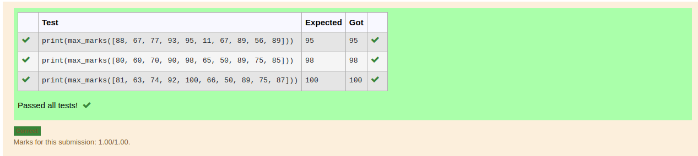
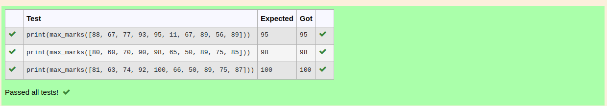
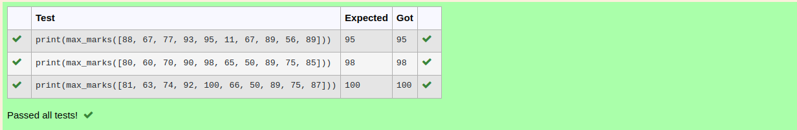

# Find the maximum of a list of numbers
## Aim:
To write a program to find the maximum of a list of numbers.
## Equipment’s required:
1.	Hardware – PCs
2.	Anaconda – Python 3.7 Installation / Moodle-Code Runner
## Algorithm:
1.	Get the list of marks as input
2.	Use the sort() function or max() function or use the for loop to find the maximum mark.
3.	Return the maximum value
## Program:

i)	# To find the maximum of marks using the list method sort.
```
'''
Program to mark the maximum of marks using the list method sort
Developed by: 
RegisterNumber: 
'''
def max_marks(marks):
    marks.sort()
    large=marks[-1]
    return large
```
ii)	# To find the maximum marks using the list method max().
```
''' 
Program to mark the maximum of marks using the list method sort
Developed by: Sriram
RegisterNumber: 22009336
'''
def max_marks(marks):
    marks.sort(reverse=True)
    n=marks[0]
    return n
```
iii) # To find the maximum marks without using builtin functions.
```
''' 
Program to find the maximum marks using the list method max().
Developed by: Sriram
RegisterNumber: 22009336
'''
def max_marks(marks):
    m=max(marks)
    return m
```
## Sample Input and Output
1.Question:



2.Question:



3.Question:



## Result:
Thus the program to find the maximum of given numbers from the list is written and verified using python programming.